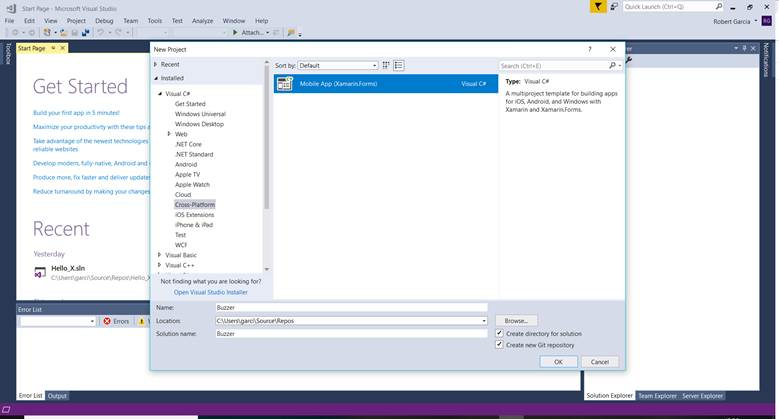

# Buzzer!

## A fun way to annoy your friends using Xamarin and Adrian Stevens' awesome Simple Audio Player!

### Introduction

Buzzer is a neat little application I wrote to annoy people who say stupid things and to get back into mobile application development using Xamarin. If you looked at the README.md for the Test Mate repositories, you'll know that my first mobile app was a port of Test Mate to my XV6700 Pocket PC using Visual C++ .NET back in 2006. I eventually ported Test Mate to the BlackBerry OS (Java), Apple's iOS (C++), Palm's webOS (HTML/JavaScript), and my Android devices (which I still use to this day). However, more and more of my friends began to ask me to write web sites, so, for almost a decade, I ended up focused on creating data-driven web applications.

The good news is that I kept up my C# skills, since I used ASP.NET rather than PHP or JavaScript to develop web applications. Therefore, I was excited when I heard about Xamarin, but unfortunately, due to life, school, and work, I was not able to follow up until now. But enough background; here's the code (and I take no responsibility for what happens when you start annoying people with it!)

---

### Steps

Open Visual Studio (we're using VS 2017) and click on New -> Project:

Expand the Visual C# node in the pane on the left and select Cross-Platform. Select Mobile App (Xamarin.Forms) from the pane on the right, name the application "Buzzer", and click OK:

Select the Blank template. Ensuring all platforms are selected and the Code Sharing Strategy is set to .NET Standard, click OK:

Once Visual Studio is finished setting up the project, open the NuGet Package Manager Console by clicking on Tools -> NuGet Package Manager -> Package Manager Console:

Type in "Install-Package Xam.Plugin.SimpleAudioPlayer" at the prompt and hit enter:

Once the package is installed, open the MainPage.xaml file (if it is not open already), and replace the code within the StackLayout to the following:

    <Label Text="Welcome to Buzzer!"
      HorizontalOptions="Center"
      VerticalOptions="CenterAndExpand" />
    <Button Text="Press Me!"
      HorizontalOptions="Center"
      VerticalOptions="CenterAndExpand"
      TextColor="White"
      BackgroundColor="Red" />

In the Solution Explorer, Right click on the Buzzer.Android project and select Set as StartUp Project:

Save all and click on Debug -> Start Debugging (or press <kbd>F5</kbd>). It will take some time for the emulator to render the phone, but when it is complete, you should see the following:

If you press the button, nothing happens. Click on Debug -> Stop Debugging (or press <kbd>Shift</kbd> <kbd>F5</kbd>) in Visual Studio. Add Clicked="Button_Clicked" to the Button control in MainPage.xaml:

Expand the MainPage.xaml node in the Solution Explorer and click on MainPage.xaml.cs to open the file (if it is not already open). Change the code to the following:

    using Plugin.SimpleAudioPlayer;
    using System;
    using System.IO;
    using System.Reflection;
    using Xamarin.Forms;

    namespace Buzzer {
        public partial class MainPage : ContentPage {
            public MainPage() {
                InitializeComponent();
            }

            private void Button_Clicked(object sender, EventArgs e) {
                ISimpleAudioPlayer player = Plugin.SimpleAudioPlayer.CrossSimpleAudioPlayer.Current;
                player.Load(GetStreamFromFile("buzzer.mp3"));
                player.Play();
            }

            private Stream GetStreamFromFile(string filename) {
                Assembly assembly = typeof(App).GetTypeInfo().Assembly;
                Stream stream = assembly.GetManifestResourceStream("Buzzer.Resources." + filename);
                return stream;
            }
        }
    }

Download the [buzzer.mp3](http://rgprogramming.com/wp-content/uploads/buzzer.mp3) file. Right click on the Buzzer project in the Solution Explorer and click on Properties:

Select Resources in the left-hand pane. You will see the following message:

Click on the message. On the following screen, click on the down arrow next to Add Resource at the top, and select Add Existing File...:

Go to the folder where you downloaded [buzzer.mp3](http://rgprogramming.com/wp-content/uploads/buzzer.mp3) and select the file:

The [buzzer.mp3](http://rgprogramming.com/wp-content/uploads/buzzer.mp3) file will be added to the Buzzer project under a folder named Resources:

However, the application cannot use the file yet. Right-click on the [buzzer.mp3](http://rgprogramming.com/wp-content/uploads/buzzer.mp3) file and select Properties:

Change the Build Action from **None** to **Embedded resource**:

Once again, save all and click on Debug -> Start Debugging (or press <kbd>F5</kbd>). Once the emulator starts, click the button and you should hear the buzz!

---

### Conclusion

There you have it: a simple application to annoy your friends. Make sure you also check out Simple Audio Player and Adrian Stevens' other Xamarin plugins at [https://github.com/adrianstevens/Xamarin-Plugins](https://github.com/adrianstevens/Xamarin-Plugins). Have fun, and once again, I take no responsibility for what happens when you start annoying people with it!

---

### References

Microsoft. (n.d.). Xamarin.Forms. Retrieved September 22, 2018, from [https://docs.microsoft.com/en-us/xamarin/xamarin-forms/](https://docs.microsoft.com/en-us/xamarin/xamarin-forms/)

Stevens, A. (2018, September 1). adrianstevens/Xamarin-Plugins. Retrieved from [https://docs.microsoft.com/en-us/xamarin/xamarin-forms/](https://docs.microsoft.com/en-us/xamarin/xamarin-forms/)
